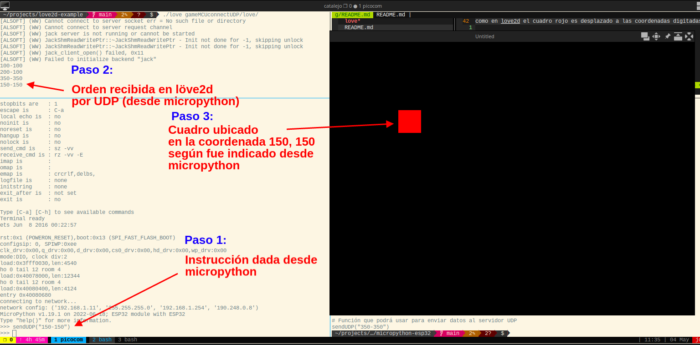

# Ejemplo de conexión UDP

En este ejemplo se lanza un servicio socket tipo UDP en el motor Love2d el cual
estará atento a las conexiones que vendrán de un esp32.

## ¿Para qué sirve?

Imagine que quiere construir su propio control de juego donde el control pueda percibir
diferentes señales provenientes de sensores (humedad, temperatura, posición, etc).
Este control puede ser creado con el microcontrolador esp32 o esp8266 y su comunicación
con el juego es realizada de manera inalámbrica.

## ¿Cómo probar este ejemplo?

### Love2d y micropython esp32
1. Requiere visitar la página oficial de [löve2d](https://love2d.org/) y descargar de allí el motor

2. Lance el motor indicando esta carpeta, ejemplo en linux:

```bash
love2d ./love/
```

3. Para el esp32 pude configurar su área de trabajo para micropython revisando el siguiente [tutorial](https://randomnerdtutorials.com/getting-started-thonny-micropython-python-ide-esp32-esp8266/)

4. En el main.py "./micropython-esp32/main.py" edite la información relacionada a la conexión WiFi, ip del serivico
de love2d.

5. Suba los tres archivos de esa carpeta ("./micropython-esp32/") a micropython instalado en el esp32, ejemplo:

* Puede hacer uso de Thonny editor para esta tarea sin requerir instalar más paquetes.

* Si hace uso de ampy, ampy se puede instalar con el comando "pip install adafruit-ampy", a continuación un ejemplo de uso:

```bash
cd ./micropython-esp32/
ampy --port /dev/ttyUSB0 put wifiAP.py
ampy --port /dev/ttyUSB0 put wifiSTA.py
ampy --port /dev/ttyUSB0 put main.py
```
6. En la terminal de micropython (Donde puede observar el prompt >>>) ejecute algunas instrucciones, verá
como en love2d el cuadro rojo es desplazado a las coordenadas digitadas.




7. Adapte el ejemplo según sea de su interés.

Regards,

Johnny Cubides
